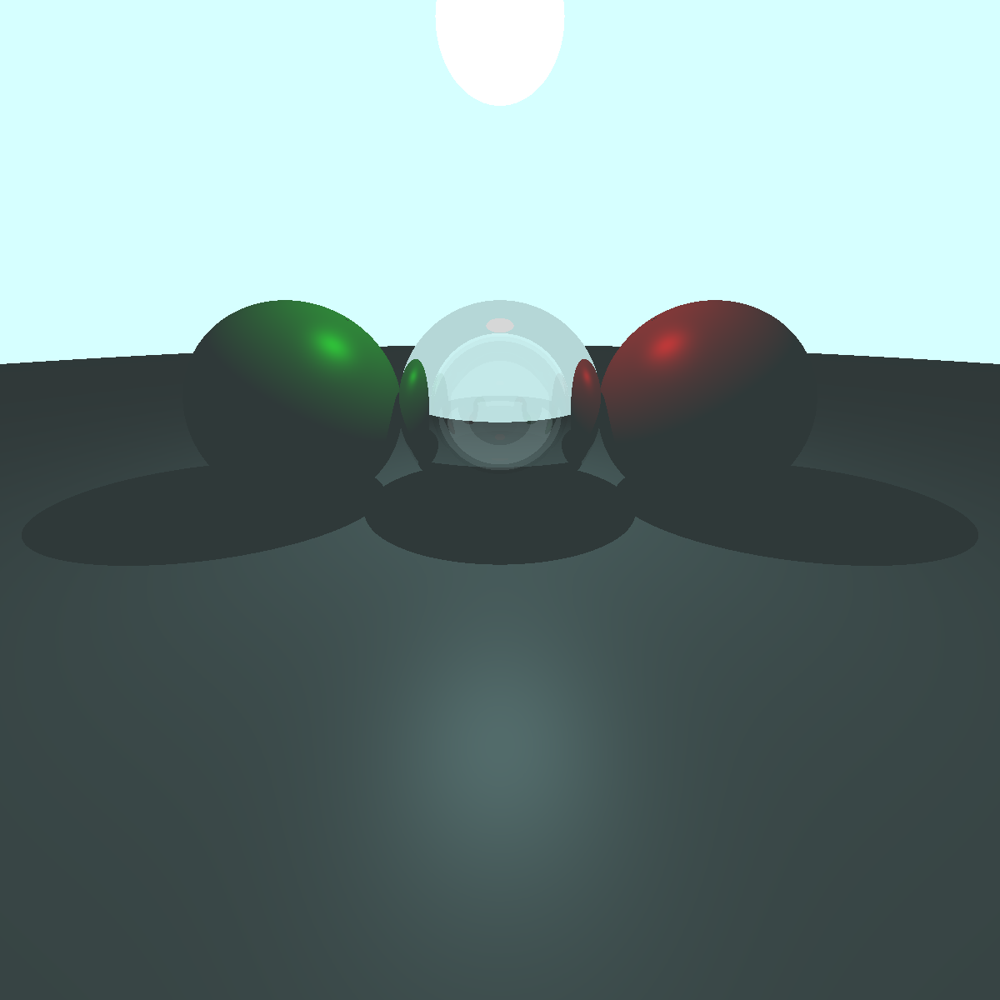

## 光线追踪实现报告
### 0. 环境
- WINDOWS
- mingw64 gcc 14.2.0

### 1. 实现 
代码实现了一个基础的光线追踪渲染器，支持 **漫反射材质**、**玻璃材质（折射与反射）** 以及 **光源材质** 的渲染。通过模拟光线与物体之间的交互，实现了真实感的图像渲染效果。


### 2. 实现原理
光线追踪是一种基于光线传播路径的渲染技术，其核心思想是从相机发射光线，通过与场景中的物体交互，计算每条光线的最终颜色。

#### 2.1. 实现算法
1. **光线与物体的相交检测：**
   - 从相机位置向场景发射光线，检测光线是否与场景中的物体相交。
   - 如果没有相交，返回背景颜色；如果有相交，则根据物体材质计算颜色。

2. **材质的光照计算：**
   - 根据物体的材质类型（漫反射、玻璃、光源）对光线的行为进行不同的处理：
     - **漫反射材质**：基于光源的位置和表面法线计算环境光、漫反射光以及镜面反射光
     - **玻璃材质**：同时计算反射光线和折射光线，并根据 Fresnel 方程混合两者
     - **光源材质**：直接返回光源的颜色

3. **递归计算：**
   - 对于玻璃材质等需要递归追踪的材质，反射和折射光线将分别继续追踪，直到达到最大递归深度或光线不再与物体相交。

4. **阴影检测：**
   - 从相交点向光源发射阴影射线，检测光源路径是否被其他物体遮挡。如果遮挡，忽略该光源的贡献。

### 3. 材质实现细节

#### 3.1. 漫反射材质 (`MatType::DIFFUSE`)

漫反射材质通过 **Lambertian 反射模型** 计算表面的光照贡献，并结合 Phong 或 Blinn-Phong 模型计算高光部分。
- **环境光：**
  ```cpp
  vec3 ambient = ka * background; // 环境光贡献
  ```

- **漫反射：**
  ```c++
  float diffuse_intensity = std::max(dot(normal, light_dir), 0.0f);
  vec3 diffuse_color = diffuse_intensity * vec3(1.0) / (dis_to_light *     dis_to_light);
  ```

- **镜面反射:**
  ```c++
  float spec_intensity = std::max(dot(view_dir, reflect_dir), 0.0f);
  spec_intensity = pow(spec_intensity, 32); // 高光强度
  vec3 specular = spec_intensity * light_ptr->mat_ptr->albedo / (dis_to_light *    dis_to_light);
  ```

- **阴影检测：**
    ```C++
    Ray shadow_ray(rec.p, light_dir);
    bool is_shadowed = scene->hit(shadow_ray, 0.001f, dis_to_light, shadow_rec);
    if (!is_shadowed) {
        finalColor += (diffuse_color + specular + blinn_specular) * rec. mat_ptr->albedo;
    }
    ```

#### 3.2. 玻璃材质 (`MatType::GLASS`)

玻璃材质需要处理光线的反射与折射，通过 Fresnel 方程 混合两种光线的颜色。

- **反射光线：**
  ```cpp
  vec3 reflect_dir = glm::reflect(ray.dir, normal);
  Ray reflect_ray(rec.p + reflect_dir * vec3(0.001), reflect_dir);
  vec3 reflect_color = trace(reflect_ray, scene, depth + 1);
  ```

- **折射光线：**
    ```c++
    vec3 refract_dir = glm::refract(ray.dir, normal, eta);
    Ray refract_ray(rec.p + refract_dir * vec3(0.001), refract_dir);
    vec3 refract_color = trace(refract_ray, scene, depth + 1);
    ```

- **混合反射与折射：**
    ```c++
    finalColor = reflect_atten * reflect_color + refract_atten * refract_color;
    ```

#### 3.3. 光源材质 (`MatType::LIGHT`)

光源材质直接返回其颜色，无需计算光照

```c++
finalColor = rec.mat_ptr->albedo;
```